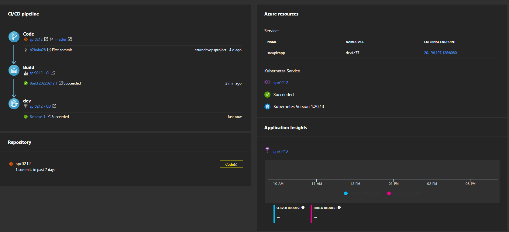
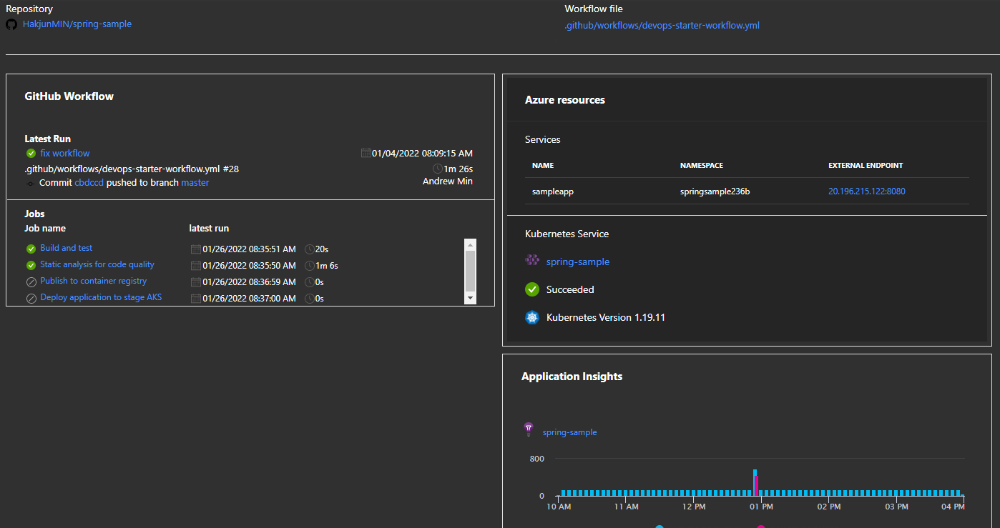
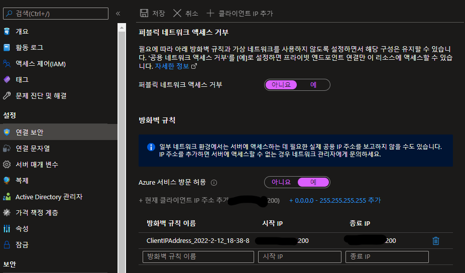
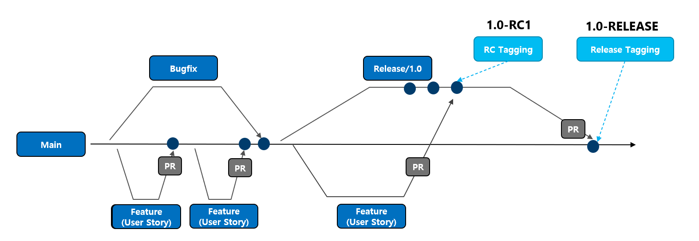
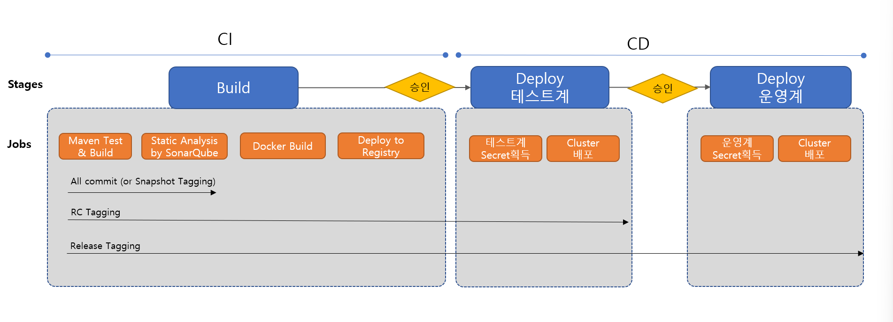
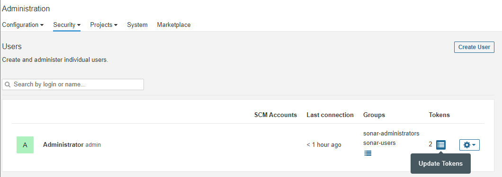
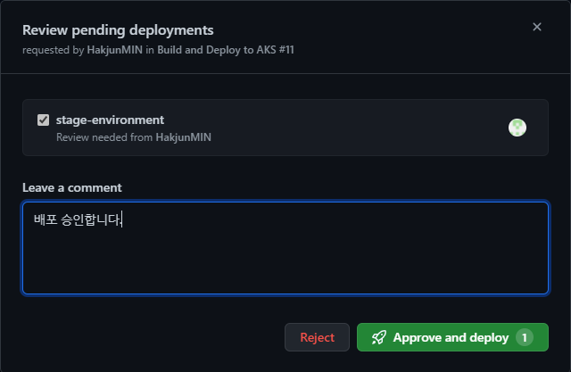

[](https://dev.azure.com/andrewmin0240/azure-spring/_build/latest?definitionId=6&branchName=feature%2Frefactor-app)
[](http://52.141.21.192:9000/dashboard?id=azure-spring) [](http://52.141.21.192:9000/dashboard?id=azure-spring) [](http://52.141.21.192:9000/dashboard?id=azure-spring) [](http://52.141.21.192:9000/dashboard?id=azure-spring)

# Azure DevOps Hands-on

## 주요 목차

1. [Quick start with DevOps Starter](#devops-starter로-원클릭-구성)
2. [Hand-on 개요](#hands-on-개요)
3. [Azure DevOps 구성](#azure-devops-조직-구성)
4. [필요환경 구성](#git-설정)
5. [목표 CI/CD 파이프라인 전략](#cicd-pipelineing을-위한-git-branch-전략)
6. [Azure Pipeline](#azure-pipeline-구성)
7. [GitHub Action](#github-action)
8. [참고자료](#참고자료)
---

## Intro
https://ideaboardz.com/for/SKR-start/4338369

## Quick Start with DevOps Starter

* 참고문서: <https://docs.microsoft.com/ko-kr/azure/devops-project/overview>

## DevOps Starter에서 `create`로 신규 프로젝트를 생성

* 랭귀지 선택 전 아래 그림과 같이 나오는 `here`링크를 통해 `Azure DevOps`와 `GitHub Action`중 하나를 선택할 수 있음.

    

> GitHub Action vs Azure DevOps?
> <https://docs.microsoft.com/ko-kr/dotnet/architecture/devops-for-aspnet-developers/actions-vs-pipelines>

* Language: `JAVA`, Framework: `Spring`, Service: `Kubernetes Service` 선택
* Project name, Azure DevOps 조직, Kubernetes 신규 생성, 로케이션 Korea Central로 선택하여 생성.

* Code리파지토리, Kubernetes 클러스터, 컨테이너 레지스트리, CI/CD 파이프라인, 애플리케이션 인사이트 (APM), 샘플코드 까지 자동으로 한 번에 생성됨.

1. DevOps Starter for Azure DevOps


2. DevOps Starter for GitHub Action


## Hands-on 개요

* 단일 Spring Boot Project, [Springs Petclinic](https://github.com/spring-projects/spring-petclinic)로 Azure의 기본적인 리소스를 사용하며 Azure DevOps를 이용한 프로덕션에 필요한 기본적인 CI/CD pipelining을 구성함.

    > Petclinic의 Microservice Architecture 버전은 [링크](https://github.com/euchungmsft/spring-petclinic-microservices) 참고)

* 주요 특징
  * Pipeline 파일은 코드로 관리
  * 별도의 GitOps Tool없이 GitOps환경 구성
  * CI와 CD 스테이지를 분리하고 승인 과정 생성
  * 정적 분석 및 수집 도구를 이용하여 테스트 결과 및 정적점검 현황 확인
  * Persistence는 별도의 Azure PaaS를 사용
  * Connection String등의 Secret정보들은 KeyVault를 통해 안전하게 중앙 집중 관리

## 필요 도구

* Azure 구독
* GitHub 계정 (무료 계정 가능)
* [Git client](https://git-scm.com/downloads)
* [Azure Cli](https://docs.microsoft.com/ko-kr/cli/azure/install-azure-cli) 2.3 이상
* [kubectl](https://kubernetes.io/ko/docs/tasks/tools/install-kubectl-linux/)
* [Helm](https://helm.sh/ko/docs/intro/install/)
* IDE (VS Code, IntelliJ .. )
* OSX, WSL, Linux
* (선택) Azure Data Studio
  
## 사용 리소스 및 환경

* Azure Kubernetes Service(incl. Container Registry)
* Azure DevOps
* Azure KeyVault
* Azure PostgreSQL
* Spring Boot 프로젝트
* SonarQube
* GitHub Action or Azure Pipeline for CI/CD Pipeline
* Code Repository (GitHub or Azure Git Repo)

## 구성 시나리오 요약

1. Azure DevOps 보드 생성
2. DevOps Starter로 원클릭 구성 (Azure Pipeline,  GitHub Action)
   * 한번에 K8S, Repo, Pipeline, 샘플 PJT, 모니터링 등 기본환경 구성
3. CI파이프라인 강화
    * SonarQube로 테스트 결과, 정적점검 결과 수집
4. CD파이프라인 강화
   * 개발계, 테스트계, 운영계 파아프라인 구성
   * 단계 별 승인과정 추가

## Azure DevOps 조직 구성

1. `https://dev.azure.com/` 로그인
2. `New Organization` 으로 새 조직 생성
    * Region은 `East asia` 선택
3. 프로젝트 생성
    * Version control은 `Git`
4. (옵션) GitHub 리파지토리 연결 필요 시
    * 생성된 프로젝트의 Project settings - GitHub Connections에서 GitHub 계정 연결
    * 리파티토리 선택 (복수개 선택 가능)

## Azure Board 구성

* [Scrum 방법론](https://docs.microsoft.com/ko-kr/devops/plan/what-is-scrum)으로 Iterative 개발 및 Deliviery를 지원하는 Azure Board 사용.

1. Delivery Plan 생성 (Product Backlog)
2. 스프린트 플래닝
    * 스프린트 백로그
    * 이터레이션 생성
    * 백로그 (사용자스토리) 스프린트 할당
3. 스프린트 착수
    * 스토리 포인트 산정
    * 코드 Linking
4. Board 관리 및 분석

## Git 설정

* Git 초기설정: <https://git-scm.com/book/ko/v2/%EC%8B%9C%EC%9E%91%ED%95%98%EA%B8%B0-Git-%EC%B5%9C%EC%B4%88-%EC%84%A4%EC%A0%95>

* Git ssh 공개키 생성: https://git-scm.com/book/ko/v2/Git-%EC%84%9C%EB%B2%84-SSH-%EA%B3%B5%EA%B0%9C%ED%82%A4-%EB%A7%8C%EB%93%A4%EA%B8%B0

## Azure Database for PostgreSQL 배포

* 어플리케이션에서 사용할 DBMS 배포.

* Azure Portal을 통해 Azure Database for PostgreSQL 생성: https://docs.microsoft.com/ko-kr/azure/postgresql/quickstart-create-server-database-portal

> 생성 후 연결문자열, ID, 패스워드 등을 KeyVault로 관리 예정

* Database생성

  * cli를 통해 DB생성
  ```bash
  az postgres db create -g <your-resource> -s <your-postgres> -n petclinic
  ```

  * 혹은,  `psql`이나 Azure Data Studio를 통해 위 생성된 서비스에 접속하여 아래를 실행
  ```sql
  CREATE DATABASE petclinic;
  ```

* Azure PostgreSQL 연결 보안 완화 - 퍼브릭 액세스, 방화벽규칙, Azure서비스 방문 허용 



## Azure KeyVault 생성

* 이 [문서](https://docs.microsoft.com/ko-kr/azure/key-vault/general/quick-create-portal)를 참고하여 서비스 생성

* 개체 > 비밀에서 아래 항목 생성
  * `postgres-pass`, `postgres-url`, `postgres-user`

```bash
    az keyvault secret set --vault-name <your-keyvault> --name postgres-url --value "jdbc:postgresql://<your-postgres-name>.postgres.database.azure.com/petclinic?sslmode=verify-full&&sslfactory=org.postgresql.ssl.SingleCertValidatingFactory&sslfactoryarg=classpath:BaltimoreCyberTrustRoot.crt.pem"

    az keyvault secret set --vault-name <your-keyvault> --name postgres-user --value <user>@<your-postgres-name>

    az keyvault secret set --vault-name <your-keyvault> --name postgres-pass --value <password>
```

## Azure DevOps 프로젝트 구성

### Azure DevOps에서 ssh 공개키 등록


> 단, http방식으로 연결할 경우 이 설정은 필요없음. 편의성을 위해 ssh사용 권고.

### 실습코드 다운로드
  
* Zip으로 다운받거나 `git clone` 수행

```bash
    git clone https://github.com/HakjunMIN/azure-petclinic.git
```

* 파이프라인은 새로 구성해야하기 때문에 `azure-pipeline.yml`은 삭제

```bash
    rm -rf azure-pipeline.yml
```

### 리파지토리 구성

```bash
    rm -rf .git
    git init
    git add . 
    git commit -am "first commit"
    git remote add origin <Your repo> # ex: git@ssh.dev.azure.com:v3/org/pjt/petclininc
    git push -u origin master
```

## 역할 별 리파지토리 구성 방안


|순번| 설명 | 특징|
|--|--|--|
|1| 프로젝트마다 개발, 테스트, 인프라코드를 상위 디렉토리에 두고 통합 구성 | 통합적 관리가 수월하나 commit, PR시 복잡성증가 |
|2| 개발, 테스트, 인프라를 별도의 프로젝트로 관리 | 통합적 관리가 어려우나 각 역할 별 명확한 commit, PR관리의 유리 |
|3| 개발, 테스트 통합 Repo, 인프라 통합 Repo로 관리 | 테스트엔지니어나 DevOps엔지니어가 Cross Function 혹은 공용 리소스일 때 각 팀의 통합적 관리 유리. |

* 조직, 역할, 리파지토리 관리 역량에 따라 리파지토리 전략을 선택할 수 있음. 파이프라인 구성 시 필요한 리파지토리를 Checkout받아 사용.

## CI/CD Pipelineing을 위한 Git Branch 전략

* [GitHub flow](https://docs.github.com/en/get-started/quickstart/github-flow)전략과 [Git flow](https://nvie.com/posts/a-successful-git-branching-model/) 전략을 혼합하여 간결하지만 통제가 가능한 효율적인 Branch전략을 운영함.



* Main (혹은 Master) 브랜치 기준으로 Feature 브랜치로 기능 개발. 계발계에 배포 필요할 경우 태깅으로 통제(ex: 1.0-SNAPSHOT1)
* Merge는 Pull Request(PR)로 리뷰 후 Merge할 수 있도록 강제
* 릴리즈를 위해서는 Release브랜치 생성. Main에 Merge되지 않은 Feature브랜치는 Release에 PR후 Merge
* RC버전 태깅(1.0-RC1)으로 Stage계 배포, RELEASE버전 태깅(1.0-RELEASE)으로 운영계 배포. 운영계 배포 후 Main에 Merge
* CI/CD 파이프라인은 Commit/PR/Tagging별로 동적 파이프라인을 구성. 예를 들면 Commit 은 기본 CI만 작동되고 PR은 CI 전체, Tagging은 개발계 or Stage계 or 운영계 배포 CD가 Trigger될 수 있도록 구성

## Azure Pipeline 구성

### 목표 CI/CD 파이프라인



> 실제 파이프라인 구성 시 CI파이프라인과 CD파이프라인은 분리하여 구성하는 것이 권장됨.

### 초기 파이프라인 생성 자동화

* Azure DevOps - Pipelines - `Create Pipeline` - `Azure Repos Git` - <repository선택>
* `Configure your pipeline` - `Deploy To Azure Kubernetes Service`

클러스터, 네임스페이스, 컨테이너 레지스트리, 이미지 이름, 서비스 포트 지정

* `azure-pipelines.yml`의 코드가 자동으로 생성되는데 **실행은 하지 않고 저장**만 해둠.
* 이렇게 생성하면 `Environment`, 클러스터와 컨테이너 레지스트리 연결을 위한 `Service Connections`, 클러스터에서 사용할 레지스트리 접속 `secret`등을 한 번에 자동으로 만들어 줌.

### Trigger 부문 수정

* CI/CD 파이프라인을 1개의 코드로 관리. 코드로 분기하여 사용. 코드가 commit되면 무조건 실행 (CI/CD 포함)되도록 `trigger`부분을 아래와 같이 변경함.

```yaml
trigger:
  tags:
    include:
      - '*'
  branches:  
    include:
      - '*'
```

### Azure KeyVault Task 추가

* Azure KeyVault Task를 이용하여 CI에 필요한 Secret정보를 획득해야 함. (ex: SonarQube정보). 상세방법은 [여기](https://docs.microsoft.com/ko-kr/azure/devops/pipelines/release/key-vault-in-own-project?view=azure-devops&tabs=portal)서 참고
* Azure DevOps - Pipelines - 파이프라인 이름 - `⁝`를 선택하여 Edit실행  
* Build Stage - jobs - job - steps - task에 가장 앞부분에 커서 위치를 두고 `Show assistant`를 클릭하여 `Azure Key Vault`항목 추가
* `Azure Subsciption`, `KeyVault` 항목을 입력하고 `Add`

```yaml
...
    - task: AzureKeyVault@2
      inputs:
        azureSubscription: '<서비스 연결명>'
        KeyVaultName: '<Your-keyvault>'
        SecretsFilter: '*'
        RunAsPreJob: false

```
* Azure Potal - 사용중인 Azure KeyVault의 `액세스 정책`에서 `AzureSubscription`에 설정된 Service Principal id에 권한을 설정해줘야함.
* Azure DevOps - Project Settings - Service Connections - AzureSubscription 정보 - `Manage Service Principal` 에서 Service Principal (애플리케이션ID) 확인
* 사용중인 KeyVault - `액세스 정책` - Create - 사용권한 (Get, List), Principal ID (어플리케이션ID)를 설정

### CI 파이프라인 기본 빌드 추가

* Maven Test, Build, Docker Build 및 배포를 수행하나 Commit과 Tagging에 따라 어느 Job까지 실행될 것인지 `condition`을 통해 정의
* Maven repository를 재활용하기 위해 Cache Task를 활용하고 필요한 변수를 아래와 같이 입력.

```yaml
variables:
  # Maven Caching
  MAVEN_CACHE_FOLDER: $(Pipeline.Workspace)/.m2/repository
  MAVEN_OPTS: '-Dmaven.repo.local=$(MAVEN_CACHE_FOLDER)'
```

* Maven Package실행 시 테스트 자동화 코드 실행을 위해 Postgres 접속정보를 KeyVault에서 가져와 옵션으로 넣어줘야 함.
* 완성된 Cache와 Maven Task는 아래와 같음.

```yaml
    - task: Cache@2
      displayName: Cache Maven local repo  
      inputs:
        key: 'maven | "$(Agent.OS)" | **/pom.xml'
        restoreKeys: |
          maven | "$(Agent.OS)"
          maven
        path: $(MAVEN_CACHE_FOLDER) 

    - task: Maven@3
      displayName: Maven Build
      inputs:
        mavenPomFile: 'Application/pom.xml'
        publishJUnitResults: true
        codeCoverageTool: 'jacoco'
        codeCoverageClassFilesDirectories:  'Application/target/classes, Application/target/testClasses'
        codeCoverageSourceDirectories: 'Application/src/java, Application/src/test'
        javaHomeOption: 'JDKVersion'
        jdkVersionOption: 1.11
        mavenVersionOption: 'Default'
        mavenOptions: '$(MAVEN_OPTS)'
        mavenAuthenticateFeed: false
        effectivePomSkip: false
        options: '-DPOSTGRES_URL=$(postgres-url) -DPOSTGRES_USER=$(postgres-user) -DPOSTGRES_PASS=$(postgres-pass)'
        goals: "-B verify"
```

* Docker 빌드 배포 Task와 upload manifests Task, Deploy Stage는 `RC`, `RELEASE` Tagging시에만 작동하도록 아래의 조건 추가

```yaml
condition: OR(contains(variables['build.sourceBranch'], 'RC'), contains(variables['build.sourceBranch'], 'RELEASE'))
```

### CI 파이프라인 내 정적 점검 추가

* Cluster에 SonarQube 설치

> 적절한 Kubernetes Cluster 연결 설정이 되어있어야 함. [여기](https://docs.microsoft.com/ko-kr/azure/aks/kubernetes-walkthrough#connect-to-the-cluster) 참고

* AKS 접속 및 Namespace생성
  
```bash
  az account set --subscription <your-subscription>
  az aks get-credentials --resource-group <your-resource-group> --name <aks-name>

  kubectl create ns sonarqube
```

* Helm Chart로 SonarQube 설치

```bash
    helm repo add sonarqube https://SonarSource.github.io/helm-chart-sonarqube
    helm upgrade --install -n sonarqube sonarqube sonarqube/sonarqube --set service.type=LoadBalancer
```
> 상용버전의 [SonarCloud](https://sonarcloud.io/) 사용시 AzurePipeline의 SonarQube용 Task(Run Code Analysis)를 사용할 수 있으나 OSS버전의 SonarQube사용 시 멀티 브랜치 분석을 할 수 없으므로 Maven의 Goal로 실행.

* SonarQube설치가 완료되면 `sonar-url`과 `sonar-token`을 KeyVault에 secret으로 생성.
  * sonar token은 메뉴 Administration - Security - Adminstrator admin - Token에서 생성
  
  

```bash
    az keyvault secret set --vault-name <your-keyvault> --name sonar-url --value "http://<sonar-host>:9000"

    az keyvault secret set --vault-name <your-keyvault> --name sonar-token --value <sonar-token>
```

* SonarQube는 `mvn sonar:sonar` 형태로 Maven Goal로 실행.
* `options`에 프로젝트키, SonarQube URL, Token등을 입력 (아래 yaml)
  
```yaml
    - task: Maven@3
      displayName: Static Analysis on SonarQube
      inputs:     
        mavenPomFile: 'Application/pom.xml'
        mavenOptions: '$(MAVEN_OPTS)'
        goals: "-B sonar:sonar"
        options: "-Dsonar.projectKey=azure-spring -Dsonar.host.url=$(sonar-url) -Dsonar.login=$(sonar-token)"
    
```

### CD (Deploy) 부문

* Deploy Stage를 별도로 구성하여 CI, CD Stage를 분리함.

#### AKS 설정

* AKS 접속
  
```bash
  az account set --subscription <your-subscription>
  az aks get-credentials --resource-group <your-resource-group> --name <aks-name>
  kubectl get node
```

* KeyVault의 Secret을 사용하기 위해 [Kubernetes CSI(Container Storage Interface)](https://kubernetes-csi.github.io/docs/)를 사용함

* AKS에서 CSI와 Managed ID를 활성화 시킴

```bash
    az aks enable-addons -a azure-keyvault-secrets-provider -n <aks-name> -g <resource-group>
    az aks update -n <aks-name> -g <resource-group> --enable-managed-identity
```

* 클러스터에 `--enable-managed-identity`를 활성화하면 아래와 같이 objectId (Managed ID)를 얻을 수 있음.
  
```
 "identity": {
        "clientId": "90e35a2c-3a2e-495a-88a6-9ca1cd5d710a",
        "objectId": "668c37cb-ee54-44bf-bc42-03e420240b5d",
        "resourceId": "/subscriptions/2f2d6dff-65ac-45fc-9180-bad1e786a763/resourcegroups/~~~~"
     }
```

* KeyVault 서비스에 secret permission을 위 AKS managed ID에 할당함
  
```bash
    az keyvault set-policy -n <your-keyvault> --secret-permissions get --object-id 668c37cb-ee54-44bf-bc42-03e420240b5d
```

* CSI Manifest 파일 [secretproviderclass](manifests/secretproviderclass.yml)을 수정.
  * `userAssignedIdentityID`에 위 Managed ID의 `clientId`를 입력
  * `tenantID`: 계정의 TenantID 입력
    > `az account list` 로 확인

    ```yaml
    (생략)
    ...
    parameters:
    usePodIdentity: "false"
    useVMManagedIdentity: "true"
    userAssignedIdentityID: "90e35a2c-3a2e-495a-88a6-9ca1cd5d710a"
    keyvaultName: "<your-keyvault>"
    cloudName: ""
    objects:  |
      array:
        - |
          objectName: postgres-url
          objectType: secret                     
          objectVersion: ""                    
        - |
          objectName: postgres-user
          objectType: secret
          objectVersion: ""
        - |
          objectName: postgres-pass
          objectType: secret
          objectVersion: "" 
    tenantId: "<your-tenant-id>"
    ```

* [secretproviderclass](manifests/secretproviderclass.yml)파일의 수정이 완료되면 Pipeline yaml 파일 내 Kubernetes Manifest파일에 추가해야 함.

```yaml
         - task: KubernetesManifest@0
            displayName: Deploy to Kubernetes cluster
            inputs:
              action: deploy
              manifests: |
                $(Pipeline.Workspace)/manifests/deployment.yml
                $(Pipeline.Workspace)/manifests/secretproviderclass.yml
                $(Pipeline.Workspace)/manifests/service.yml
            
```

* Deployment Manifest 파일([deployment.yml](manifests/deployment.yml))에 Image정보 수정, Application Insight 사용시 아래의 `APPINSIGHTS_INSTRUMENTATIONKEY` 할당
* PostgreSQL 사용 시 아래 `SPRING_PROFILES_ACTIVE`에 `postgres`로 할당. [`application-postgres.properties`](Application/src/main/resources/application-postgres.properties)을 참고하게됨.
  
    ```yaml
    (중략)
    spec:
    ..
        spec:
        containers:
          - name: azurespring 
            image: <your-registry>/<your-project-image>
    ..
            env:
            - name: APPINSIGHTS_INSTRUMENTATIONKEY
              value: "<your-applicationInsights-InstrumentationKey>"   
            - name: SPRING_PROFILES_ACTIVE
              value: ""   
    ```

#### 배포 Environment 구성

* [초기 파이프라인 자동화 과정](#초기-파이프라인-생성-자동화)을 거쳐 생성된 Deploy Stage는 자동으로 1개의 Environment가 생성되어 있음
* Azure DevOps - Pipelines - Environments 내에서 확인
* Stage계와 Production계 배포를 위한 Envrionment를 각각 생성하고 배포 리소스(Cluster, Namespace)를 선택.
  
    | Environment | Resource (Cluster.Namespace) |
    | -- | -- |
    | Stage | `<your-cluster>.<stage용 namespace>`|
    | Production | `<your-cluster>.<production용 namespace>`|

    > 실제 현업에서 Production용으로 구축 시엔 Dev계와 Stage계를 1개의 `non-prod` Cluster로 생성하여 Namespace로 구분하고 Production은 별도의 `prod` Cluster로 구성하는 것을 권고.

#### CD 파이프라인 작성

* Azure DevOps Pipeline Editor를 실행하여 기 생성된 배포 파이프라인을 Stage 배포 Stage와 Production 배포 Stage를 별도로 구성
    
    > Stage용어가 동일하여 혼란스러우나 배포의 [`Stage계`](https://en.wikipedia.org/wiki/Deployment_environment#Staging)는 운영환경과 유사한 테스트환경이라고 보면되고 [`Pipeline Stage`](https://docs.microsoft.com/ko-kr/azure/devops/pipelines/process/stages?view=azure-devops&tabs=yaml)는 작업의 최상단 그룹임.

#### Deploy시 승인 과정 추가

* Stage계와 Production계로 구분한 후 `environment`정의. environment별 리소스 (여기선 Kubernetes Resourcef)를 정의하고 다음과 같은 체크 항목을 정의할 수 있음.

| 구분    | 설명                                    |
| ---------- | ---------------------------------------------- |
| Approval | Deploy전 특정 사용자(그룹)에게 승인을 받아야함. |
| Branch Control  | 특정 브랜치에서만 배포가 되도록 구성 |
| Businees Hours  | 특정시간에만 배포가 가능하도록 설정 |

> 이 프로젝트에서는 Approval기능만 사용함. Branch Control은 파이프라인 코드 내 `condition`으로 통제

#### CD 샘플 파이프라인 코드

* `condition`추가: Branch 조건은 `contains(variables['build.sourceBranch'], 'RELEASE')`와 같이 통제하고 Stage는 `RC`, `RELEASE`, Production은 `RELEASE` Tagging시에만 Triggering되도록 구성.
* `secretproviderclass` manifest 추가: KeyVault를 사용하기 위한 CSI
* 최종 완성된 샘플 파이프라인 코드는 아래와 유사.

```yaml
- stage: Deploy
  displayName: Deploy stage
  dependsOn: Build
  condition: OR(contains(variables['build.sourceBranch'], 'RC'), contains(variables['build.sourceBranch'], 'RELEASE'))

  jobs:
  - deployment: Deploy
    displayName: Deploy
    pool:
      vmImage: $(vmImageName)
    environment: 'stage.staged48e'
    strategy:
      runOnce:
        deploy:
          steps:
          - task: KubernetesManifest@0
            displayName: Create imagePullSecret
            inputs:
              action: createSecret
              secretName: $(imagePullSecret)
              dockerRegistryEndpoint: $(dockerRegistryServiceConnection)

          - task: KubernetesManifest@0
            displayName: Deploy to Kubernetes cluster
            inputs:
              action: deploy
              manifests: |
                $(Pipeline.Workspace)/manifests/deployment.yml
                $(Pipeline.Workspace)/manifests/secretproviderclass.yml
                $(Pipeline.Workspace)/manifests/service.yml
              imagePullSecrets: |
                $(imagePullSecret)
              containers: |
                $(containerRegistry)/$(imageRepository):$(tag)             
         
```

> Stage배포를 복사하여 Environment만 변경한 후 Prod배포 스크립트를 완성.

### 파이프라인 테스트

#### CI 테스트

```bash
#코드 변경 후 
git commit -am "change something"
git push
```

#### CD 테스트

```bash
#코드 변경 후 
git commit -am "change something"
git tag 0.0.1-RC1
git push --tags
```

#### 전체 [`azure-pipeline`](azure-pipelines.yml) 샘플 참고

**모든 Hands-on이 완료되면 사용하지 않는 리소스는 정리**

---

## GitHub Action

* GitHub Action의 완성된 파이프라인은 Azure pipeline과 같이 정적점검과 환경 별 승인과정을 사용함.


> KeyVault와 Azure Database for PostgreSQL부문은 생략함. 필요시 [이 문서](https://docs.microsoft.com/ko-kr/azure/developer/github/github-key-vault)를 참고하여 구성.

* 샘플 코드는 https://github.com/HakjunMIN/azure-petclinic 에서 개인 리파지토리로 Fork하거나 Clone후 [여기](#리파지토리-구성)의 방법으로 개인 라파지토리에 재연결

> 환경 설정 자동화를 위해 DevOps Starter를 사용하여 구성할 수 있으나 항목 별 이해를 돕기 위해 수작으로 아래와 같이 작성.

### Service Princaipal 생성

* GitHub Action에서 사용할 Service Principal 생성

```yaml
az ad sp create-for-rbac --name "myApp" --role contributor \
                            --scopes /subscriptions/{subscription-id}/resourceGroups/{resource-group} \
                            --sdk-auth
```

* 위 결과로 나온 Output json을 GitHub리파지토리 메뉴 Settings - Secret - Actions - New repository secret에 `AZURE_CREDENTIALS` 항목으로 입력

## Workflow 작성

* 완성된 yaml파일은  [`.github/workflows/devops-starter-workflow.yml`](.github/workflows/devops-starter-workflow.yml) 참고

### 환경변수 입력

```yaml
name: Build and Deploy to AKS
on: push

env:
  RESOURCEGROUPNAME: "" # your resource group
  LOCATION: "Korea Central"
  SUBSCRIPTIONID: "" # your subsctiption id
  IMAGENAME: "" # your project name
  REGISTRYSKU: "Standard"
  REGISTRYNAME: "" # your registry name ex)azurespringacr
  REGISTRYLOCATION: "" # registry location ex)South Central US
  CLUSTERNAME: "" # your cluster
  APPINSIGHTSLOCATION: "Korea Central"
  CLUSTERLOCATION: "Korea Central"

  OMSLOCATION: "Korea Central"
  OMSWORKSPACENAME: "" # log analytics 작업역역
  HTTPSAPPLICATIONROUTINGENABLED: false
  KUBERNETESAPI: "apps/v1"
  NAMESPACE: "" # 클러스터 내 Namespace ex)stage
```

### CI 부문 생성

```yaml
jobs:
  build:
    name: Build and Static analysis
    runs-on: ubuntu-latest
    steps:
    - uses: actions/checkout@v2
    - name: Set up JDK 11
      uses: actions/setup-java@v1
      with:
        java-version: 11

    # 빠른 실행을 위해 Maven repository를 Caching하여 사용    
    - name: Restore Maven cache
      uses: skjolber/maven-cache-github-action@v1
      with:
        step: restore    
    - name: package
      id: build-test
      run: |
          cd Application
          ./mvnw -B verify 

    # 한번 다운로드 받은 라이브러리는 Caching
    - name: Save Maven cache
      uses: skjolber/maven-cache-github-action@v1
      with:
        step: save       

```

### SonarQube용 Task추가

* 정적분석을 위한 SonarQube를 수행. Secret항목 내 `SONAR_TOKEN`과 `SONAR_URL`을 미리 설정 (Github 리파지토리 - Settings - Sercret - Actions - New repository secret)

> SonarQube정보는 [위 문서 참고](#ci-파이프라인-내-정적-점검-추가)
  
```yaml
    - name: Official SonarQube Scan
     
      uses: SonarSource/sonarqube-scan-action@v1.0.0
      with:
        # Additional arguments to the sonar-scanner
        args: # optional
        # Set the sonar.projectBaseDir analysis property
        projectBaseDir: Application    
      env:
        SONAR_TOKEN: ${{ secrets.SONAR_TOKEN }}
        SONAR_HOST_URL: ${{ secrets.SONAR_URL }}         
```

### Registry 배포

`if: contains (github.ref, 'RC') || contains (github.ref, 'RELEASE')` 로 `RC`,`RELEASE` Tagging시에만 수행

```yaml
  publish:
    name: Publish to container registry
    if: contains (github.ref, 'RC') || contains (github.ref, 'RELEASE')
    runs-on: ubuntu-latest
    needs: build
    steps:
    - uses: actions/checkout@v2
    - name: Set up JDK 11
      uses: actions/setup-java@v1
      with:
        java-version: 11
    - name: Restore Maven cache
      uses: skjolber/maven-cache-github-action@v1
      with:
        step: restore      
    - name: pacakge 
      run: |
          cd Application
          ./mvnw -B package -Dmaven.test.skip=true
    # login to azure
    - name: Login to Azure
      uses: azure/login@v1
      with: 
        creds: ${{ secrets.AZURE_CREDENTIALS }}

    - name: Get ACR credentials
      id: getACRCred
      run: |
           echo "::set-output name=acr_username::`az acr credential show -n ${{ env.REGISTRYNAME }} --query username | xargs`"
           echo "::set-output name=acr_password::`az acr credential show -n ${{ env.REGISTRYNAME }} --query passwords[0].value | xargs`"
           echo "::add-mask::`az acr credential show -n ${{ env.REGISTRYNAME }} --query passwords[0].value | xargs`"
    
    - name: Build and push image to ACR
      id: build-image
      run: |
        echo "::add-mask::${{ steps.getACRCred.outputs.acr_password }}"
        docker login ${{ env.REGISTRYNAME }}.azurecr.io --username ${{ steps.getACRCred.outputs.acr_username }} --password ${{ steps.getACRCred.outputs.acr_password }}
        docker build "$GITHUB_WORKSPACE/Application" -f  "Application/Dockerfile" -t ${{ env.REGISTRYNAME }}.azurecr.io/${{ env.IMAGENAME }}:${{ github.sha }}
        docker push ${{ env.REGISTRYNAME }}.azurecr.io/${{ env.IMAGENAME }}:${{ github.sha }}
 ```

### Kubernetes Cluster배포 작성

```yaml
  deploy-stage:
    name: Deploy application to stage AKS 
    if: contains (github.ref, 'RC')
    environment:
      name: stage-environment
    needs: publish
    runs-on: ubuntu-latest
    steps:
    - uses: actions/checkout@v2
    # login to azure
    - name: Login to Azure
      uses: azure/login@v1
      with:
        creds: ${{ secrets.AZURE_CREDENTIALS }}

    - name: Get AKS Credentials
      id: getContext
      run: |
          az aks get-credentials --resource-group ${{ env.RESOURCEGROUPNAME }} --name ${{ env.CLUSTERNAME }} --file $GITHUB_WORKSPACE/kubeconfig
          echo "KUBECONFIG=$GITHUB_WORKSPACE/kubeconfig" >> $GITHUB_ENV

    - name: Create namespace
      run: |
        namespacePresent=`kubectl get namespace | grep ${{ env.NAMESPACE }} | wc -l`
        if [ $namespacePresent -eq 0 ]
        then
            echo `kubectl create namespace ${{ env.NAMESPACE }}`
        fi

    - name: Get ACR credentials
      id: getACRCred
      run: |
           echo "::set-output name=acr_username::`az acr credential show -n ${{ env.REGISTRYNAME }} --query username | xargs`"
           echo "::set-output name=acr_password::`az acr credential show -n ${{ env.REGISTRYNAME }} --query passwords[0].value | xargs`"
           echo "::add-mask::`az acr credential show -n ${{ env.REGISTRYNAME }} --query passwords[0].value | xargs`"

    - uses: azure/k8s-create-secret@v1
      with:
        namespace: ${{ env.NAMESPACE }}
        container-registry-url: ${{ env.REGISTRYNAME }}.azurecr.io
        container-registry-username: ${{ steps.getACRCred.outputs.acr_username }}
        container-registry-password: ${{ steps.getACRCred.outputs.acr_password }}
        secret-name: ${{ env.CLUSTERNAME }}dockerauth

    - name: Fetch Application insights key
      id: GetAppInsightsKey
      run: |
        echo "::set-output name=AIKey::`az resource show -g ${{ env.RESOURCEGROUPNAME }} -n ${{ env.CLUSTERNAME }} --resource-type "Microsoft.Insights/components" --query "properties.InstrumentationKey" -o tsv`"
        echo "::add-mask::`az resource show -g ${{ env.RESOURCEGROUPNAME }} -n ${{ env.CLUSTERNAME }} --resource-type "Microsoft.Insights/components" --query "properties.InstrumentationKey" -o tsv`"

    - uses: azure/k8s-bake@v1
      id: bakeManifests
      with:
        renderEngine: 'helm'
        helmChart: './Application/charts/sampleapp' 
        overrideFiles: './Application/charts/sampleapp/values.yaml'
        overrides: |
            image.repository:${{ env.REGISTRYNAME }}.azurecr.io/${{ env.IMAGENAME }}
            image.tag:${{ github.sha }}
            imagePullSecrets:{${{ env.CLUSTERNAME }}dockerauth}
            applicationInsights.InstrumentationKey:${{ steps.GetAppInsightsKey.outputs.AIKey }}
            apiVersion:${{ env.KUBERNETESAPI }}
            extensionApiVersion:${{ env.KUBERNETESAPI }}
        helm-version: 'latest' 
        silent: 'true'

    - uses: azure/k8s-deploy@v1
      with:
        namespace: ${{ env.NAMESPACE }}
        manifests: ${{ steps.bakeManifests.outputs.manifestsBundle }}
        images: |
          ${{ env.REGISTRYNAME }}.azurecr.io/${{ env.IMAGENAME }}:${{ github.sha }}
        imagepullsecrets: |
          ${{ env.CLUSTERNAME }}dockerauth

    - name : Cleanup
      run: | 
        az logout
        rm -rf $GITHUB_WORKSPACE/kubeconfig

```

### Deploy 과정 시 승인과정 추가

* GitHub 리파지토리 - Settings - Environments - 이미 생성된 `stage-environment` 선택.
* Required reviewers 체크박스 선택후 이름 지정, Save protection rules 클릭.
* Deploy 시 다음과 같이 승인자가 승인할 수 있음



## 테스트

### [Azure Pipeline과 동일](#파이프라인-테스트)

## CI/CD 뱃지 생성

* 뱃지를 통해 현재 리파지토리의 CI/CD, 정적점검, 테스트 커버리지 등을 확인할 수 있음. 
  
> 본 페이지 맨 위 쪽 샘플) 프로젝트의 뱃지를 참고할 것. 이 프로젝트의 뱃지가 아닌 다른 샘플 프로젝트의 뱃지임.

## 참고자료

### Azure Pipeline 참고자료

* https://docs.microsoft.com/ko-kr/azure/devops/?view=azure-devops
* https://docs.microsoft.com/ko-kr/azure/devops/pipelines/?view=azure-devops
* https://docs.microsoft.com/ko-kr/azure/devops/pipelines/process/environments-kubernetes?view=azure-devops
  
### GitHub Action 참고자료

* 개요: https://docs.microsoft.com/ko-kr/azure/developer/github/github-actions
* GitHub Action 문서: https://docs.github.com/en/actions
* Azure Board연결: https://docs.microsoft.com/ko-kr/azure/devops/boards/github/?view=azure-devops
* Azure KeyVault사용: https://docs.microsoft.com/ko-kr/azure/developer/github/github-key-vault

## 회고

https://ideaboardz.com/for/SKR-Retrospective/4338366